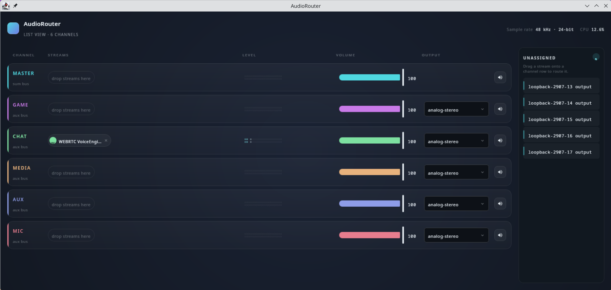

# AudioRouter

A cross-platform desktop application that replicates the SteelSeries GG Sonar feature — virtual per-category audio channels with independent volume control, per-application routing, and real-time VU meters.

Built with **Kotlin + Compose Multiplatform Desktop**. Audio backends: PipeWire (`pactl`) on Linux, CoreAudio on macOS, WASAPI on Windows.



---

## Features

- **6 virtual audio channels** — Master, Game, Chat, Media, Aux, Mic
- **Per-application routing** — assign any audio stream to a channel; rules persist across app restarts
- **Independent volume & mute** per channel
- **Per-channel output selection** — route different channels to different audio devices (e.g. headset for Chat, speakers for Media)
- **Real-time stereo VU meters** — driven by actual PipeWire monitor sources, not simulated
- **Drag-and-drop assignment** — drag a stream from the unassigned panel onto a channel row; tap for a menu fallback
- **System tray** — hide to tray, restore with a click (uses StatusNotifierItem for KDE Plasma 6 / Wayland)
- **Live CPU & sample rate display** in the header
- **Config persistence** — volumes, mutes, routing rules and output choices saved to `~/.config/AudioRouter/config.json`

---

## Requirements

### Linux
| Dependency | Version |
|---|---|
| PipeWire | ≥ 0.3 with PulseAudio compat layer |
| `pactl` | ≥ 17.0 |
| JDK | 21+ (tested with Amazon Corretto 24) |
| Gradle | 8.14+ (wrapper included) |

Tested on **Bazzite Linux** (KDE Plasma 6, Wayland).

### macOS
| Dependency | Notes |
|---|---|
| JDK | 21+ |
| [BlackHole](https://github.com/ExistentialAudio/BlackHole) | Optional — required for virtual channels and per-channel output routing |

**macOS feature matrix:**

| Feature | Status |
|---|---|
| Device discovery & output selection | ✅ Full support via CoreAudio |
| Volume & mute per channel | ✅ Full support via CoreAudio |
| Real-time VU meters | ✅ via `javax.sound.sampled` (captures from matched device) |
| Virtual channels (Game, Chat, Media…) | ⚠️ Requires BlackHole aggregate devices named `AudioRouter_Game` etc. |
| Per-app stream routing | ❌ Not supported — macOS has no public API for moving audio streams |

To set up virtual channels with BlackHole:
1. Install [BlackHole 16ch](https://github.com/ExistentialAudio/BlackHole)
2. Open **Audio MIDI Setup** → create a **Multi-Output Device** including BlackHole + your speakers/headphones
3. Create a **Multi-Output Device** for each channel you want to route separately, named `AudioRouter_Game`, `AudioRouter_Chat`, etc.

### Windows
| Dependency | Notes |
|---|---|
| JDK | 21+ |
| [VB-Cable](https://vb-audio.com/Cable/) | Optional — required for virtual channel routing |

Per-app routing on Windows requires VB-Cable or similar virtual audio driver. Volume and mute work via WASAPI without additional software.

---

## Installation & Setup

### Linux

1. **Install JDK 21+**
   ```bash
   # Fedora / Bazzite
   sudo dnf install java-21-amazon-corretto
   # Ubuntu / Debian
   sudo apt install openjdk-21-jdk
   # Arch
   sudo pacman -S jdk21-openjdk
   ```

2. **Verify PipeWire + pactl**
   ```bash
   pactl info | grep "Server Name"
   # Should show: Server Name: PulseAudio (on PipeWire ...)
   ```

3. **Run from source**
   ```bash
   git clone https://github.com/your-username/audiorouter.git
   cd audiorouter
   ./gradlew run
   ```
   > Run from a terminal with `DISPLAY` or `WAYLAND_DISPLAY` set. The Gradle `run` task forwards these automatically.

4. **Or install a package**
   ```bash
   ./gradlew packageRpm   # → build/compose/binaries/main/rpm/AudioRouter-1.0.0.rpm
   sudo dnf install build/compose/binaries/main/rpm/AudioRouter-*.rpm

   ./gradlew packageDeb   # → build/compose/binaries/main/deb/audiorouter_1.0.0_amd64.deb
   sudo dpkg -i build/compose/binaries/main/deb/audiorouter_*.deb

   ./gradlew packageAppImage  # portable, no install needed
   ```

---

### macOS

1. **Install JDK 21+**
   ```bash
   brew install --cask corretto@21
   ```

2. **(Optional) Install BlackHole for virtual channels**

   Without BlackHole the app still works for volume/mute control and VU meters, but each channel won't have its own isolated audio path.

   ```bash
   brew install blackhole-16ch
   ```

   Then in **Audio MIDI Setup** (`/Applications/Utilities/Audio MIDI Setup.app`):
   - Click **+** → **Create Aggregate Device**
   - Name it exactly `AudioRouter_Game` and tick **BlackHole 16ch** as an input
   - Repeat for `AudioRouter_Chat`, `AudioRouter_Media`, `AudioRouter_Aux`, `AudioRouter_Mic`
   - Add your real output device (speakers/headphones) to each aggregate

3. **Run from source**
   ```bash
   git clone https://github.com/your-username/audiorouter.git
   cd audiorouter
   ./gradlew run
   ```
   > macOS will prompt for **Microphone** permission on first launch — required for VU meter level capture.

4. **Or build a DMG**
   ```bash
   ./gradlew packageDmg
   # → build/compose/binaries/main/dmg/AudioRouter-1.0.0.dmg
   open build/compose/binaries/main/dmg/AudioRouter-1.0.0.dmg
   ```

---

### Windows

1. **Install JDK 21+**

   Download and run the [Amazon Corretto 21 installer](https://corretto.aws/downloads/latest/amazon-corretto-21-x64-windows-jdk.msi).

2. **(Optional) Install VB-Cable for virtual channels**

   Without VB-Cable the app still works for volume/mute control and VU meters.

   Download from [vb-audio.com/Cable](https://vb-audio.com/Cable/) and run the installer as Administrator.

3. **Run from source**
   ```powershell
   git clone https://github.com/your-username/audiorouter.git
   cd audiorouter
   .\gradlew.bat run
   ```

4. **Or build an MSI**
   ```powershell
   .\gradlew.bat packageMsi
   # → build\compose\binaries\main\msi\AudioRouter-1.0.0.msi
   ```

---

## How It Works

On startup AudioRouter:

1. Loads config from `~/.config/AudioRouter/config.json` (Linux/macOS) or `%APPDATA%\AudioRouter\config.json` (Windows)
2. Detects the platform and initialises the matching audio backend (PipeWire / CoreAudio / WASAPI)
3. **Linux:** Scans for orphaned `AudioRouter_*` PipeWire modules from a previous crash, then creates one null-sink + loopback pair per channel
4. **macOS:** Detects pre-existing `AudioRouter_*` aggregate devices (BlackHole-based); stubs channels that aren't present
5. **Windows:** Maps channels to VB-Cable virtual inputs if available
6. Applies stored volumes and mutes to each channel sink
7. Subscribes to audio-system events for real-time stream tracking
8. Re-applies saved per-app routing rules to already-running streams
9. Starts per-channel level capture processes to feed the live VU meters

On shutdown (window close, tray quit, or SIGTERM) all virtual modules are unloaded cleanly (Linux only — macOS/Windows stubs are persistent devices).

---

## Architecture

```
PipeWireService        pactl / pw-cli shell wrapper
VirtualSinkManager     null-sink + loopback lifecycle per channel
StreamMonitor          pactl subscribe → SharedFlow of AudioEvents
RoutingEngine          consumes events, applies AppRules, moves streams
VolumeController       debounced volume/mute per channel sink
LevelMonitor           pacat per-channel RMS → StateFlow<Pair<Float,Float>>
ConfigRepository       atomic JSON read/write, debounced saves

UI (Compose Multiplatform Desktop)
  MainWindowStack      root layout — channel rows + unassigned drawer
  ChannelRow           VU meter · volume slider · output picker · mute
  VuMeter              real-level stereo bar with peak hold
  DragController       pointer-tracked drag state for stream assignment
```

---

## Config File

Located at `~/.config/AudioRouter/config.json`. Edited automatically — no need to touch it manually.

```json
{
  "version": 1,
  "outputSinkName": "alsa_output.pci-0000_00_1f.3.analog-stereo",
  "channelOutputSinks": {
    "CHAT": "alsa_output.usb-headset.analog-stereo"
  },
  "channelVolumes": { "MASTER": 100, "GAME": 85, "CHAT": 90, "MEDIA": 75, "AUX": 100, "MIC": 80 },
  "channelMutes":   { "MASTER": false, "GAME": false, "CHAT": false, "MEDIA": false, "AUX": false, "MIC": false },
  "appRules": [
    { "appName": "Firefox",  "channel": "MEDIA" },
    { "appName": "Discord",  "channel": "CHAT"  },
    { "appName": "Steam",    "channel": "GAME"  }
  ]
}
```

---

## Tech Stack

| Layer | Technology |
|---|---|
| Language | Kotlin 2.0.21 |
| UI | Compose Multiplatform Desktop 1.7.3 (Material 3) |
| Audio backend (Linux) | PipeWire via `pactl` / `pacat` |
| Audio backend (macOS) | CoreAudio + CoreFoundation via JNA |
| Audio backend (Windows) | WASAPI via JNA (COM interfaces) |
| Async | Kotlin Coroutines 1.9.0 |
| Serialization | kotlinx.serialization 1.7.3 |
| System tray | dorkbox/SystemTray 4.4 (StatusNotifierItem / KDE Plasma 6) |
| Logging | kotlin-logging + Logback |
| Build | Gradle 8.14 (Kotlin DSL) |
